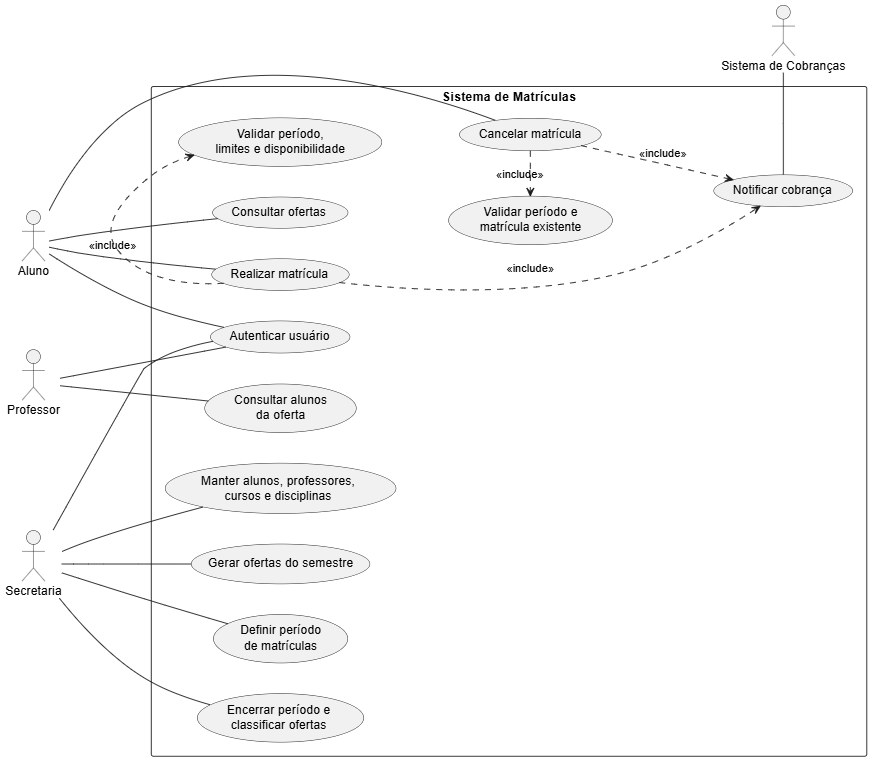

# LAB02S01 - Modelo de análise

**Gabriella Fernanda Silva Pinto** 
**Igor Vidal Meneghini** 
**Izabella Romano Bizerra Seabra** 
**Natália dos Reis Santos**

**Instituição:** Pontifícia Universidade Católica de Minas Gerais — PUC Minas  
**Curso:** Engenharia de Software  

## Escopo

O Sistema de Matrículas atende alunos, professores e secretaria. Um sistema externo de cobranças recebe notificações das matrículas realizadas.

## Atores

- **Aluno:** autentica-se, consulta ofertas, realiza e cancela matrículas.
- **Professor:** autentica-se e consulta os alunos de suas ofertas.
- **Secretaria:** autentica-se e mantém alunos, professores, cursos, disciplinas, ofertas semestrais e o período de matrículas; ao final, encerra o período.
- **Sistema de Cobranças:** recebe os dados necessários para cobrar o aluno pelas disciplinas do semestre.

## Regras de negócio

- RN01: todo usuário precisa de login e senha válidos.
- RN02: matrícula e cancelamento só podem ocorrer durante um período aberto.
- RN03: cada aluno pode escolher no máximo quatro ofertas obrigatórias e duas optativas por semestre.
- RN04: cada oferta aceita no máximo 60 alunos.
- RN05: ao atingir 60 matrículas, a oferta deixa de aceitar novas inscrições.
- RN06: ao final do período, uma oferta com pelo menos três alunos fica ativa; com menos de três, é cancelada.
- RN07: a cobrança deve ser notificada quando uma matrícula é realizada e também quando ela é cancelada.
- RN08: um aluno não pode se matricular duas vezes na mesma oferta.
- RN09: o professor só consulta a lista de alunos das ofertas sob sua responsabilidade.

## Histórias de usuário

### HU01 - Autenticar usuário

**Como** usuário do sistema, **quero** entrar com login e senha **para** acessar apenas as funções do meu perfil.

Critérios de aceitação:

- credenciais válidas iniciam uma sessão com o perfil correto;
- credenciais inválidas não liberam acesso.

### HU02 - Manter cadastros acadêmicos

**Como** funcionário da secretaria, **quero** cadastrar e consultar alunos, professores, cursos e disciplinas **para** manter os dados acadêmicos atualizados.

Critérios de aceitação:

- não é permitido repetir matrícula, registro funcional ou código;
- cada disciplina deve estar vinculada a um curso.

### HU03 - Preparar o semestre

**Como** funcionário da secretaria, **quero** criar ofertas de disciplinas e definir o período de matrícula **para** disponibilizar o currículo do semestre.

Critérios de aceitação:

- a oferta referencia disciplina, professor, semestre e tipo obrigatória/optativa;
- o período possui início, fim e situação aberta ou encerrada.

### HU04 - Consultar ofertas

**Como** aluno, **quero** consultar as ofertas do semestre **para** decidir minhas opções.

Critérios de aceitação:

- devem ser exibidos código, disciplina, professor, tipo, situação e vagas disponíveis.

### HU05 - Realizar matrícula

**Como** aluno, **quero** matricular-me em uma oferta **para** cursar a disciplina no próximo semestre.

Critérios de aceitação:

- a operação ocorre somente em período aberto;
- são respeitados os limites de quatro obrigatórias, duas optativas e 60 alunos por oferta;
- duplicidade é rejeitada;
- após o sucesso, o sistema de cobranças é notificado.

### HU06 - Cancelar matrícula

**Como** aluno, **quero** cancelar uma matrícula durante o período permitido **para** alterar minhas escolhas.

Critérios de aceitação:

- somente uma matrícula existente e do próprio aluno pode ser cancelada;
- o cancelamento libera a vaga e atualiza a cobrança.

### HU07 - Consultar alunos da turma

**Como** professor, **quero** listar os alunos das minhas ofertas **para** conhecer a composição das turmas.

Critérios de aceitação:

- o professor não acessa turmas atribuídas a outro professor;
- a lista apresenta matrícula e nome dos alunos.

### HU08 - Encerrar o período

**Como** funcionário da secretaria, **quero** encerrar o período de matrícula **para** confirmar ou cancelar as ofertas do semestre.

Critérios de aceitação:

- ofertas com três ou mais alunos tornam-se ativas;
- ofertas com menos de três alunos tornam-se canceladas;
- nenhuma nova matrícula ou cancelamento é aceito depois do encerramento.

## Diagrama de casos de uso

